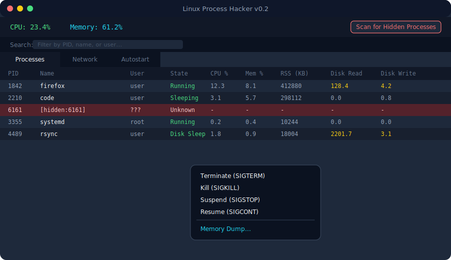
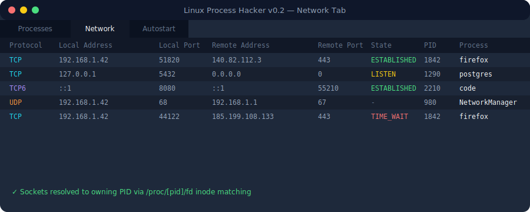
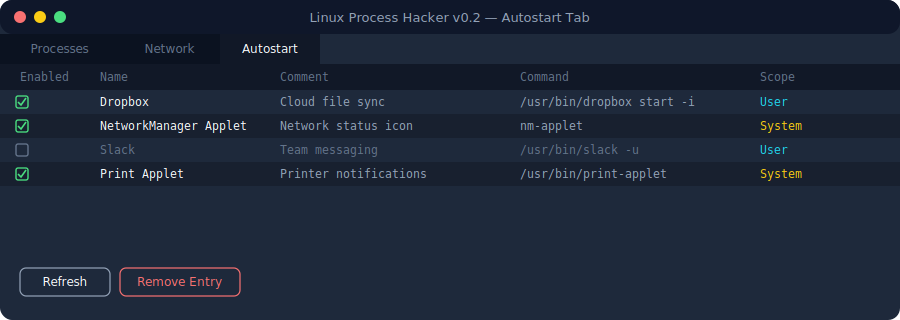
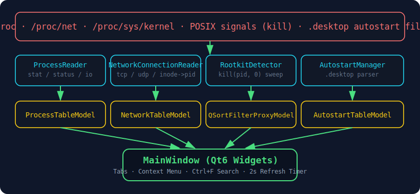

<div align="center">


<br/>

[](../../releases/latest)
[](#-requirements)
[](#-tech-stack)
[](#-tech-stack)
[](#-license)

**A native, no-nonsense system & process monitor for Linux — built directly on top of `/proc`.**
No Electron. No Python wrapper. Just C++17, Qt6 Widgets, and raw syscalls.

[Features](#-features) · [Screenshots](#-screenshots) · [Installation](#-installation) · [Build from source](#-build-from-source) · [Architecture](#-architecture)

</div>

---

## ⚡ Quick Start (prebuilt binary)

Grab the latest binary from the **[Releases](../../releases/latest)** page — no build step required.

```bash
# 1. Download the binary from the Releases page, then:
chmod +x LinuxProcessHacker

# 2. Run it:
./LinuxProcessHacker
```

That's it. No installer, no dependencies to hunt down (assuming Qt6 runtime libraries are present on your distro).

> **Current stable release:** `v0.2` — see [Changelog](#-changelog) below.

---

## 📚 Table of Contents

- [Features](#-features)
- [Screenshots](#-screenshots)
- [Installation](#-installation)
- [Build from Source](#-build-from-source)
- [Architecture](#-architecture)
- [Project Structure](#-project-structure)
- [Permissions & Root Access](#-permissions--root-access)
- [Tech Stack](#-tech-stack)
- [Changelog](#-changelog)
- [Roadmap](#-roadmap)
- [Contributing](#-contributing)
- [License](#-license)

---

## ✨ Features

<table>
<tr>
<td width="72" align="center"></td>
<td>

### Process Management
Live process table refreshed every 2 seconds, parsed straight from `/proc/[pid]/stat`, `/status`, `/cmdline`, and `/exe`. Right-click any row for a full signal control menu:

- **Terminate** — `SIGTERM`
- **Kill** — `SIGKILL`
- **Suspend** — `SIGSTOP`
- **Resume** — `SIGCONT`

All signals are sent via the standard POSIX `::kill(pid_t, int)` call. The table force-refreshes immediately after every action so you see the result instantly.

</td>
</tr>
<tr>
<td width="72" align="center"></td>
<td>

### Network Connection Monitor
A dedicated **Network** tab lists every active TCP/UDP (IPv4 & IPv6) connection, parsed directly from `/proc/net/tcp[6]` and `/proc/net/udp[6]`. Sockets are resolved back to their owning process by matching socket inodes against every `/proc/[pid]/fd/*` entry — so you always know *which app* opened *which connection*. Right-click a connection to signal its owning process directly.

</td>
</tr>
<tr>
<td width="72" align="center"></td>
<td>

### Rootkit / Hidden Process Detector
Some malware hides its PID from `/proc` by hooking syscalls. Linux Process Hacker cross-checks the visible process list against a full `kill(pid, 0)` sweep across every PID up to `/proc/sys/kernel/pid_max`. If a PID responds (returns `0` or `EPERM`) but has **no matching `/proc/[pid]` directory**, it's flagged as hidden and highlighted in **alarming red** directly in the process table. The scan runs on a background `QThread` so the UI never freezes.

</td>
</tr>
<tr>
<td width="72" align="center"></td>
<td>

### Disk I/O Monitor
Two extra columns — **Disk Read (KB/s)** and **Disk Write (KB/s)** — track exactly which process is hammering your disk. Values are computed as a live delta between successive reads of `/proc/[pid]/io` (`read_bytes:` / `write_bytes:`), so you get real throughput, not just cumulative totals.

</td>
</tr>
<tr>
<td width="72" align="center"></td>
<td>

### Memory Dumper
Right-click any process → **Memory Dump...** to open a dedicated dialog that lists every mapped memory region from `/proc/[pid]/maps`. From there you can:

- **Extract Strings** — pulls printable ASCII sequences straight out of process memory (a built-in `strings`-style scanner), each tagged with its virtual address.
- **Dump Region to `.bin`** — copies a raw memory region to your Desktop for offline analysis in a hex editor.

Reads go through `/proc/[pid]/mem` via `pread()`. Root privileges are typically required to inspect processes you don't own.

</td>
</tr>
<tr>
<td width="72" align="center"></td>
<td>

### Autostart Manager
A full **Autostart** tab reads and merges entries from both `~/.config/autostart/` (user) and `/etc/xdg/autostart/` (system-wide), following the [freedesktop.org Desktop Entry Specification](https://specifications.freedesktop.org/autostart-spec/). Toggle any entry on/off with a single checkbox click:

- Disabling a **system-wide** entry automatically creates a safe user-level override (copy-on-write) instead of touching protected files.
- **Remove Entry** deletes user-level `.desktop` files outright.

</td>
</tr>
<tr>
<td width="72" align="center"></td>
<td>

### Instant Search (Ctrl+F)
Press **`Ctrl+F`** anywhere in the app to pop open a live filter bar above the process table. Type a PID, process name, or username and the table filters instantly via `QSortFilterProxyModel` — case-insensitive, across every column. Press the **✕** button or `Ctrl+F` again to dismiss it.

</td>
</tr>
</table>

---

## 🖼 Screenshots

> UI mockups shown below — actual appearance may vary slightly depending on your Qt style/theme.

<div align="center">

**Processes tab** — live table, signal context menu, hidden-process highlighting



<br/><br/>

**Network tab** — every TCP/UDP socket resolved to its owning process



<br/><br/>

**Autostart tab** — merged user + system entries with one-click toggling



</div>

---

## 📦 Installation

### Option A — Prebuilt binary (recommended)

1. Head over to the **[Releases](../../releases/latest)** page.
2. Download the `LinuxProcessHacker` binary for the latest stable release (**v0.2**).
3. Make it executable and run it:

```bash
chmod +x LinuxProcessHacker
./LinuxProcessHacker
```

4. (Optional) Move it somewhere on your `$PATH` for convenience:

```bash
sudo mv LinuxProcessHacker /usr/local/bin/
LinuxProcessHacker
```

### Option B — Build it yourself

See [Build from Source](#-build-from-source) below.

---

## 🔨 Build from Source

### Prerequisites

| Dependency | Minimum Version |
|---|---|
| CMake | 3.16+ |
| Qt6 | 6.x (`Core`, `Widgets`, `Gui`) |
| A C++17 compiler | GCC 9+ / Clang 10+ |

On Debian/Ubuntu-based systems:

```bash
sudo apt update
sudo apt install build-essential cmake qt6-base-dev
```

### Build

```bash
git clone https://github.com/<your-username>/linux-process-hacker.git
cd linux-process-hacker

cmake -B build -DCMAKE_BUILD_TYPE=Release
cmake --build build -j$(nproc)
```

### Run

```bash
./build/LinuxProcessHacker
```

> **Note:** some features (signaling processes you don't own, reading `/proc/[pid]/mem`, viewing hidden system processes) require elevated privileges. Run with `sudo` if you need full access:
> ```bash
> sudo ./build/LinuxProcessHacker
> ```

---

## 🏗 Architecture

Linux Process Hacker follows a strict **reader → model → view** pipeline. Every data source under `/proc` (or `/proc/net`, or `.desktop` files) has its own dedicated reader class that knows nothing about Qt's UI layer — it just returns plain data structs. Qt's `QAbstractTableModel` subclasses sit in between, and `MainWindow` wires everything together on a 2-second refresh timer.

<div align="center">

</div>

Key design decisions:

- **Flat file structure.** Every `.cpp` / `.h` / `.ui` file lives in the project root — no `src/`, no `include/`, no nested folders. This keeps the codebase easy to grep and navigate for a project of this size.
- **No blocking I/O on the UI thread for expensive scans.** The rootkit detector's full PID sweep can touch up to `pid_max` (often 32768+) PIDs, so it runs on a dedicated `QThread` (`RootkitScanWorker`) and reports back via queued signals.
- **Self-explanatory code, zero comments.** Class and method names are written to be unambiguous on their own (`computeIoDeltaPerSecond`, `resolvePidForInode`, `copySystemEntryToUserOverride`, etc.).
- **`QSortFilterProxyModel` for search**, not manual filtering — keeps sorting, filtering, and the underlying data model fully decoupled.

---

## 🗂 Project Structure

```
linux-process-hacker/
├── CMakeLists.txt
├── main.cpp
├── MainWindow.{h,cpp,ui}
│
├── ProcFsUtils.{h,cpp}                 # Low-level /proc reading primitives
├── ProcessInfo.{h,cpp}                 # Process data struct
├── ProcessReader.{h,cpp}               # stat / status / cmdline / exe / io parsing
├── ProcessTableModel.{h,cpp}           # Qt table model for the Processes tab
├── ProcessSignalSender.{h,cpp}         # POSIX kill() wrapper (SIGTERM/SIGKILL/SIGSTOP/SIGCONT)
│
├── SystemStatReader.{h,cpp}            # /proc/stat CPU usage
├── MemInfoReader.{h,cpp}               # /proc/meminfo
│
├── NetworkConnectionInfo.{h,cpp}       # Connection data struct
├── NetworkAddressParser.{h,cpp}        # Hex-encoded IPv4/IPv6 decoding
├── SocketInodeResolver.{h,cpp}         # inode → owning PID mapping
├── NetworkConnectionReader.{h,cpp}     # tcp/tcp6/udp/udp6 parsing
├── NetworkTableModel.{h,cpp}           # Qt table model for the Network tab
│
├── RootkitDetector.{h,cpp}             # kill(pid, 0) brute-force sweep
├── RootkitScanWorker.{h,cpp}           # Background QThread wrapper
│
├── MemoryRegion.{h,cpp}                # /proc/[pid]/maps region struct
├── MemoryMapsParser.{h,cpp}            # maps file parser
├── ProcessMemoryDumper.{h,cpp}         # pread() on /proc/[pid]/mem, string extraction
├── MemoryDumpDialog.{h,cpp,ui}         # Memory dump UI dialog
│
├── AutostartEntry.{h,cpp}              # .desktop entry data struct
├── DesktopFileParser.{h,cpp}           # freedesktop .desktop file parser/writer
├── AutostartManager.{h,cpp}            # User + system autostart directory scanning
├── AutostartTableModel.{h,cpp}         # Qt table model for the Autostart tab
│
└── .github/assets/                     # README images (not part of the build)
```

All source files are English-named and English-commented in identifiers only — the codebase intentionally ships with **zero inline comments**; naming carries the documentation load instead.

---

## 🔐 Permissions & Root Access

Several features touch privileged kernel interfaces. A quick reference:

| Feature | Root required? |
|---|---|
| View your own processes, CPU, memory, network | ❌ No |
| Signal (kill/suspend/resume) processes **you own** | ❌ No |
| Signal processes **owned by other users** | ✅ Yes |
| Rootkit / hidden-process scan | ⚠️ Partial — some PIDs owned by other users only resolve correctly as root |
| Read `/proc/[pid]/mem` for **your own** processes | ⚠️ Often yes, depending on distro hardening (Yama ptrace_scope) |
| Read `/proc/[pid]/mem` for **other users' processes** | ✅ Yes |
| Toggle a **system-wide** autostart entry | ❌ No — a safe user-level override is created automatically |

---

## 🧰 Tech Stack

<div align="center">


</div>

- **C++17** — core language
- **Qt6 Widgets** — `QMainWindow`, `QTableView`, `QAbstractTableModel`, `QSortFilterProxyModel`, `QThread`
- **CMake 3.16+** — build system, `qt_add_executable` with `CMAKE_AUTOMOC` / `CMAKE_AUTOUIC`
- **Raw `/proc` parsing** — no third-party system-info libraries; everything is read straight from the kernel's procfs
- **POSIX** — `<signal.h>`, `<sys/types.h>`, `<unistd.h>` (`pread`, `kill`)

---

## 📋 Changelog

### `v0.2` — Stable *(current)*
- ✅ Rootkit / hidden process detector with background-threaded `kill(pid, 0)` sweep
- ✅ Disk I/O monitor — live Disk Read/Write (KB/s) columns
- ✅ Memory Dumper — string extraction and raw `.bin` region dumps via `/proc/[pid]/mem`
- ✅ Instant `Ctrl+F` search/filter bar across the process table
- ✅ New **Autostart** tab — view, toggle, and remove `.desktop` autostart entries

### `v0.1` — Initial Release
- ✅ Flat-structure CMake project scaffold
- ✅ Live process table (`/proc/[pid]/stat`, `/status`, `/cmdline`, `/exe`)
- ✅ CPU & memory usage summary (`/proc/stat`, `/proc/meminfo`)
- ✅ Network Connection Monitor — TCP/UDP/IPv4/IPv6 with PID resolution via inode matching
- ✅ Right-click signal context menu (`SIGTERM` / `SIGKILL` / `SIGSTOP` / `SIGCONT`)

---

## 🗺 Roadmap

- [ ] Per-core CPU usage graphs (data already collected in `SystemStatReader::readPerCoreCpuSnapshots`)
- [ ] Process tree / parent-child hierarchy view
- [ ] Export process/network snapshots to CSV or JSON
- [ ] Configurable refresh interval
- [ ] systemd service inspector tab
- [ ] Dark/light theme toggle

Have an idea? Open an issue!

---

## 🤝 Contributing

Contributions are welcome. A few ground rules this project follows, to keep the codebase consistent:

1. **Flat structure only** — no new subdirectories for source files.
2. **English identifiers, zero inline comments** — names must be self-explanatory.
3. One class = one responsibility (reader, parser, model, or dialog — not a mix).
4. Please test manually against a real `/proc` on Linux before opening a PR — there's no CI test suite (yet).

```bash
git checkout -b feature/my-feature
# ... make your changes ...
git commit -m "Add my feature"
git push origin feature/my-feature
```

Then open a Pull Request.

---

## 📄 License

Distributed under the **MIT License**. See `LICENSE` for details.

---

<div align="center">

Built with 🖤 and raw `/proc` reads.

**[⬆ back to top](#)**

</div>
